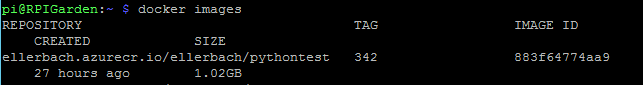

# Full example of Raspberry Pi with Camera using OpenCV Docker image, Python 3, Azure IoT Edge and Azure Blob Storage

Some time ago, I've build a solution in my garden using a RaspberryPi (RPI), connected to Azure, sending temperature, wind speed, direction, air and soil humidifies. I did as well connect it to my own bot. So I iam able to ask my bot to send me a picture of my greenhouse just from Skype or Telegram for example.

This project was done using NodeJS and the very recent at that time Azure IoT SDK for Node. Sources are [still available here](https://github.com/Ellerbach/nodejs-webcam-azure-iot).

So very naturally, I decided to create the same project with the new Azure IoT Python SDK. And as there is now the opportunity to have IoT Edge devices and benefit of easy deployment of code thru containers, I've decided to do both at the same time.

What are the challenges in this project?

* There is a need of building a container for the RPI containing Python 3.5 and OpenCV to access to the webcam
* Building an app in Python, connecting to Azure IoT Edge, listening to messages and posting the image to a blob storage
* Setting up the RPI for Azure IoT Edge, setting up the parameters

So let's start with the code part.

## Building the Python app, getting messages from Azure IoT hub, taking a picture and uploading it to Azure Blob

The Python app is quite simple. On one side I have a class taking pictures and saving pictures. And one part connecting to Azure IoT Hub and publishing into an Azure Blog Storage.

### The Camera capture class

This class does only contains one exposed function to take and save a picture. The other classes are internal ones.

Initializing the camera is done thru ```cv2.VideoCapture(0)```. 0 is for the first video device. As there is just one webcam plugged, it's the one which will be used.

```PY
import os
import cv2
import numpy as np
import datetime

class camera:
    "take a picture and saved it in the static folder"

    def __init__(self):
        # take the first camera
        self.cam = cv2.VideoCapture(0)
        pass
```

Take the picture is done thru ```ret, frame = self.cam.read()```. It does return a frame. The rest of the code is about adding a time stamp to the image. It create a sub image with have the same width as the main image, then write the date and time, then concatenate both image vertically, so the datetime will be under the picture and finally save the image.

```PY
def TakePicture(self):
        # read a frame
        ret, frame = self.cam.read()
        # where the code is running should be /app
        img_name = os.getcwd() + os.path.normpath("/static/image.jpg")
        _, width = frame.shape[:2]
        # Create a black image with same width as main image
        img = np.zeros((50,width,3), np.uint8)
        # Write the date
        font = cv2.FONT_HERSHEY_COMPLEX_SMALL
        bottomLeftCornerOfText = (10,25)
        fontScale = 1
        fontColor = (255,255,255)
        lineType = 1
        # format the datetime
        today = datetime.datetime.now()
        thedate = '{:%Y/%m/%d %H:%M:%S}'.format(today)
        cv2.putText(img, thedate,
            bottomLeftCornerOfText,
            font,
            fontScale,
            fontColor,
            lineType)
        # Add both images and save the final image
        vis = np.concatenate((frame, img), axis=0)
        cv2.imwrite(img_name, vis)
```

Something important to note is that the image is saved into a specific path. Flask uses a ```static``` folder to serve all static content. And the image will be saved before being served by the web server. So it has to store in this specific directory. The function ```os.getcwd()``` provide the working directory. As you can see in the container, it is the ```/app``` directory which contains both the py files as well as the static folder and an example of image.

The ```__exist__``` function is just here to clean and close properly the camera once the Python code finishes. It is normally done when the Python session finished all up, but it's always better to leave things cleaned :-)

```PY
    def __enter__(self):
        return self

    def __exit__(self, exc_type, exc_value, traceback):
        # close camera
        self.cam.release()
```

### The web server using flask

I've decided to add a web server in the container to be able to easily test it. And I have as well another service at home which saves pictures every few minutes as well as allow me to receive them by mail time to time. Yes, I love to see how my cucumbers and salads are growing :-)

Flask is very easy to use. There are still couple of tricks to know.

```PY
from flask import Flask
from takepicture import camera

app = Flask(__name__)

@app.route('/')
def hello():
    return "Hello from python flask webapp!, try /image.jpg /postimage"

@app.route('/image.jpg')
def image():
    cam.TakePicture()
    return app.send_static_file('image.jpg')

@app.route('/postimage')
def postimage():
    postblob()
    return "image posted https://portalvhdskb2vtjmyg3mg.blob.core.windows.net/webcam/picture"

if __name__ == '__main__':
    # initialize the camera
    cam = camera()
    # initialize IoTHub
    client = iothub_client_init()
    # run flask, host = 0.0.0.0 needed to get access to it outside of the host
    app.run(host='0.0.0.0',port=1337)
```

This is a very basic example of Flask. The / path return just some text. The /image.jpg returns the actual image. It does illustrate the ```send_static_file('image.jpg')``` function which returns an actual file stored into the ```/static``` folder. That's the reason why the image is created there.

/postimage just call the same function as when a message is received from Azure IoT Hub by the device. And return a text.

In the ```__name__``` part, the camera is initialized, Azure IoT Hub as well. And finally Flask as well.

Flask tip 1: use ```port=``` to run the web server on a specific port

Flask tip 2 and **most important**: use ```host='0.0.0.0'``` if you want your web server to be accessible by any device. You can restrict the IP range if you want to let for example a subnet accessing. If you omit this, by default, only the machine running the code will have access. So in case you forget, only the code from the container will have access!

### Posting the image in the Azure Blob Storage

If you don't have an Azure Blob Storage yet, just go to the [docs](https://docs.microsoft.com/en-us/azure/storage/) and create one. In few minutes, you'll be ready!

Thanks to the Python SDK, it is extremly easy to post anything in a Blob storage. Authentication to the blob storage is as easy as ```blob_service = BlockBlobService(account_name, account_key)```. And posting as easy as ```blob_service.create_blob_from_path(container_name, 'picture', os.getcwd() + "/static/image.jpg")```.

```PY
from azure.storage.blob import BlockBlobService, PublicAccess

try:
    account_name= os.environ["BLOB_ACCOUNT_NAME"]
except KeyError:
    pass

try:
    account_key= os.environ["BLOB_ACCOUNT_KEY"]
except KeyError:
    pass

def postblob():
    blob_service = BlockBlobService(account_name, account_key)
    container_name = 'webcam'
    # in case you need to create the container
    # blob_service.create_container(container_name)
    # blob_service.set_container_acl(container_name, public_access=PublicAccess.Container)
    cam.TakePicture()
    blob_service.create_blob_from_path(
        container_name,
        'picture',
        os.getcwd() + "/static/image.jpg"
    )
```

You'll not the ```os.environ["BLOB_ACCOUNT_NAME"]``` in a try except bloc. This is the way to test if an environement variable exist and if it does exist, save it into both variables used to access the blob storage.

It is very easy to set environment variables in Azure IoT Edge, we will see later how to do it.

If the container is not created or you want to make sure it is, with the right access rights, use The 2 more commented lines. Keep in mind the access of the container looks like: ```https://portalvhdskb2vtjmyg3mg.blob.core.windows.net/webcam/picture``` where:

* ```portalvhdskb2vtjmyg3mg``` is the account name
* ```webcam``` is the container name
* ```picture``` is the object name. It can be even ```image.jpg``` or any other name.

### Azure IoT Hub connection and receiving messages

To connect to Azure IoT Hub, you'll need to create an Azure IoT Hub. As always, in few minutes following the [docs](https://docs.microsoft.com/en-us/azure/iot-hub/), you'll be ready to go.

Once you'll have your hub created, using the same docs, create an IoTEdge device. You'll need to get the connection string for later on.

```PY
from iothub_client import IoTHubClient, IoTHubTransportProvider
from iothub_client import IoTHubMessage, IoTHubMessageDispositionResult
from iothub_client import IoTHubClientRetryPolicy

TIMEOUT = 241000
MINIMUM_POLLING_TIME = 9
# messageTimeout - the maximum time in milliseconds until a message times out.
# The timeout period starts at IoTHubClient.send_event_async.
# By default, messages do not expire.
MESSAGE_TIMEOUT = 10000
# chose HTTP, AMQP, AMQP_WS or MQTT as transport protocol
PROTOCOL = IoTHubTransportProvider.MQTT

# String containing Hostname, Device Id & Device Key in the format:
# "HostName=<host_name>;DeviceId=<device_id>;SharedAccessKey=<device_key>"
try:
    CONNECTION_STRING = os.environ["CONNECTION_STRING"]
except KeyError:
    pass

def receive_message_callback(message, counter):
    message_buffer = message.get_bytearray()
    msg = message_buffer[:size].decode('utf-8')
    if(msg == "image"):
        postblob()
    return IoTHubMessageDispositionResult.ACCEPTED

def iothub_client_init():
    # prepare iothub client
    client = IoTHubClient(CONNECTION_STRING, PROTOCOL)
    if client.protocol == IoTHubTransportProvider.HTTP:
        client.set_option("timeout", TIMEOUT)
        client.set_option("MinimumPollingTime", MINIMUM_POLLING_TIME)
    # set the time until a message times out
    client.set_option("messageTimeout", MESSAGE_TIMEOUT)
    # to enable MQTT logging set to 1
    if client.protocol == IoTHubTransportProvider.MQTT:
        client.set_option("logtrace", 0)
    client.set_message_callback(
        receive_message_callback, 0)

    retryPolicy = IoTHubClientRetryPolicy.RETRY_INTERVAL
    retryInterval = 100
    client.set_retry_policy(retryPolicy, retryInterval)
    return client

```

The most complicated part if the ```iothub_client_init()```. It does prepare all what is needed to have the authentication with Azure IoT Hub as well as setting up the call back methods. I've let the choice between using HTTP and MQTT in this code. I do recommend MQTT. But it shows you that the way to handle the connections between those 2 protocols is slightly different. By essence, HTTP is a pure disconnected protocol while MQTT is not.

The very interesting part is the ```receive_message_callback(message, counter)``` function. Once a message is sent to the Azure IoT Hub for the device, this function will be called. The message is encoded and need to be decoded.

The code is very straight forward, it just decode, check if the message is "image" and if true, call the function to take a picture and upload it to the blob storage.

This code is not posting any data on Azure IoT Hub. It can of course. But it's done in another part of the code, I did not rewrite yet. And it can be anyway in another container. This allow to separate various function and feature and allowing to deploy updates for only parts of the code.

## Building a Docker OpenCV image with Python 3.5 for RaspberryPi and other armhf devices

On armhf for the Raspberry, there is no pre made PyPi (pip) install. So in short, we'll have to fully build an image for the RPI. OpenCV is a very powerful library but it's a bit one with tons of dependencies.
One good source to learn how to recompile correctly OpenCV is to use the site [pyimagesearch](https://www.pyimagesearch.com/). I've been using it as a first source as it does give a good view of dependencies, what needs to be downloaded, the build settings.

Once I understood the key principles, and did it once, I started to put everything at once in a docker image. You'll find 3 files in the project compiling various versions of OpenCv 3.3.0, 3.4.1 and 3.4.2. I've been adjusting a bit dependencies as well as what I wanted to build in the project.

### Creating the Docker image with only Python 3.5 and OpenCV

To do this, we need to start with an existing image. resin has built various images of Raspberry Pi. We will use the later stretch image. We will as well make sure we are in a cross compilation environment.

```CMD
FROM resin/rpi-raspbian:stretch

#Enforces cross-compilation through Quemu
RUN [ "cross-build-start" ]
```

Then we will add all the dependencies to properly build OpenCV, get python and pip.

```CMD
RUN apt-get update && apt-get upgrade \
               && apt-get install -y --no-install-recommends \
                              build-essential cmake pkg-config \
                              libjpeg-dev libtiff5-dev libjasper-dev libpng-dev \
                              libavcodec-dev libavformat-dev libswscale-dev libv4l-dev \
                              libxvidcore-dev libx264-dev \
                              libgdk-pixbuf2.0-dev \
                              libfontconfig1-dev \
                              libcairo2-dev \
                              libpango1.0-dev \
                              libgdk-pixbuf2.0-dev \
                              libpango1.0-dev \
                              libxft-dev \
                              libfreetype6-dev \
                              libpng-dev \
                              libgtk2.0-dev \                              libgtk-3-dev \
                              libatlas-base-dev gfortran \
                              python3-dev \
                              python3-pip \
                              wget \  
                              unzip \
               && rm -rf /var/lib/apt/lists/* \
               && apt-get -y autoremove \
```

Then download and extract the OpenCV source code

```CMD
               && wget -O opencv.zip https://github.com/opencv/opencv/archive/3.4.2.zip \
               && unzip opencv.zip \
               && rm -rf opencv.zip \
               && wget -O opencv_contrib.zip https://github.com/opencv/opencv_contrib/archive/3.4.2.zip \
               && unzip opencv_contrib.zip \
               && rm -rf opencv_contrib.zip \
```

Then we will make sure we'll have the last version of PyPi and install numpy

```CMD
               && pip3 install --upgrade pip \
               && pip install numpy \
```

And finally build OpenCV and clean the source code.

```CMD
&& cd opencv-3.4.2/ \
               && mkdir build \
               && cd build \
               && cmake -D CMAKE_BUILD_TYPE=RELEASE \
                    -D CMAKE_INSTALL_PREFIX=/usr/local \
                    -D OPENCV_EXTRA_MODULES_PATH=../../opencv_contrib-3.4.2/modules \
                    -D BUILD_EXAMPLES=ON \
                    -D BUILD_WITH_DEBUG_INFO=OFF \
                    -D BUILD_DOCS=OFF \
                    -D BUILD_EXAMPLES=OFF \
                    -D BUILD_TESTS=OFF \
                    -D BUILD_opencv_ts=OFF \
                    -D BUILD_PERF_TESTS=OFF \
                    -D INSTALL_C_EXAMPLES=OFF \
                    -D INSTALL_PYTHON_EXAMPLES=ON \
                    .. \
               # this is for building on a RPI to use all the cores
               # && make -j4 \
               && make \
               && make install \
               && ldconfig \
               && rm -rf ../../opencv-3.4.2 ../../opencv_contrib-3.4.2

RUN [ "cross-build-end" ]  
```

This will allow to build the container. You can build it on a Raspberry Pi or on a Windows machine with Docker installed. I've tried both method and it is much faster on a Windows machine. For this, you just need to make sure you have Docker running Linux containers.

```CMD
docker build -t ellerbach/opencv:342 -f opencv-342.Dockerfile .
```

Be patient, it will take a while, couple of hours. Full size of the image is bit less than 1Gb.

#### Build done correctly

Yea! celebrate, all good, you made it!

#### Something went wrong

It can happen. This can be due to multiple factors, so check them carefully:

* Check the error message, it can be due to a missing library. So just change the library, add/remove it from the list
* It can be due to an incompatibility version between 2 libraries. It happened a lot to me with similar projects. Try to find the problem, remove the dependencies and try to add remove some of the libraries up to the point you won't get any issue
* A library is missing and you have the message during the OpenCV compilation, so just add it to the dependency list

Tip: slice the problem, create intermediate images if needed. I explained the principle in [this repository](https://github.com/Ellerbach/Raspberry-Docker-Tensorflow-Pillow-Flask).

### Creating the image for the final application

The final application is a Python app using Azure IoT Edge so it will require the [Azure IoT Python SDK](https://github.com/Azure/azure-iot-sdk-python) as well as Azure Blog Storage so it will require [Azure Storage Python SDK](https://github.com/Azure/azure-storage-python). Installation is quite straight forward, don't forget to add libboost-python-dev as Azure IoT Hub is using it. I'm using as well flask as you can see from the code section. The dockerfile for the app is available [here](./CameraIoTEdge/Dockerfile). This Docker file is then much simpler than the previous one:

```CMD
FROM ellerbach/opencv:342

ADD app app

RUN apt-get update && apt-get upgrade \
    && apt-get install libboost-python-dev \
    && pip3 install azure-iothub-device-client \
    && pip3 install azure-storage-blob \
    && pip3 install flask \
    && pip3 install numpy \
    && sudo rm -rf /var/lib/apt/lists/*

# Set the working directory
WORKDIR /app

EXPOSE 1337

# Run the flask server for the endpoints
CMD ["python3","AzurePost.py"]
```

To build the image we will have to do a traditional:

```CMD
docker build -t ellerbach/pythontest:342 .
```

This will take couple of minutes, at this stage, all should be good and working.

### Pushing the docker image to the Azure Container Registry (ACR)

Once you're created you image, you'll need to push it to your own Azure Container Registry. By default your registry is private allowing to store images in a secure way, deploying them in a secure way as well.

#### Step 1: Create your Azure Container Registry

Takes only few clicks when you have an Azure subscription. All explained [here](https://docs.microsoft.com/en-us/azure/container-registry/). Use your preferred method, either CLI, either Portal, either PowerShell :-)

#### Step 2: log to the ACR

From a command line where you have build the previous image, log in:

```CMD
docker login myregistry.azurecr.io -u yourusername -p yourpassword
```

where:

* ```myregistry``` is your registry name
* ```yourusername``` is your user name
* ```yourpassword``` is your password

You'll find all of them easilly in the portal. As for example from the documentation:


#### Step 3: tag your image for ACR

In order to be able to push the image, it needs to be tagged. In my case:

```CMD
docker tag ellerbach/pythontest:342 ellerbach.azurecr.io/ellerbach/pythontest:342
```

I'm using the previous built image and tag it for my Azure CR. You can use a short name, no need to add sub directories. I did it just for the example.  

#### Step 4: push your image

The classical push will make it. Just keep in mind you're pushing it to your Azure Container Registry. So you have to be logged.

```CMD
docker push ellerbach.azurecr.io/ellerbach/pythontest:342
```

Depending on your available bandwidth, it may take couple of minutes.

#### Step 5: check all is ok

Go to the Azure portal, connect, go to your created directory and check if your image is present:


In my case, I can find the one tagged 342.

## Deploying Azure IoT Edge on the device and setting up the Azure IoT Edge on the server saide

Now we've created our code, our container, the last step is to setup Azure IoT Edge. I will show how to do it in the portal. It is as well possible using CLI or the VS Code extension.

### Create an Azure IoT Hub

To connect to Azure IoT Hub, you'll need to create an Azure IoT Hub. As always, in few minutes following the [docs](https://docs.microsoft.com/en-us/azure/iot-hub/), you'll be ready to go.

### Create an Azure IoT Edge device

From your newly created Azure IoT Edge, you can now create an IoT Edge device. Click on IoT Edge, then Add IoT Edge, fill the name, click add and you'll see your device in the device list like in the picture below:


### Installing Azure IoT Edge runtime on the device

To install the runtime on your Raspberry, [follow the docs](https://docs.microsoft.com/en-us/azure/iot-edge/how-to-install-iot-edge-linux-arm). It is very well done, step by steps and as well all you need to troubleshoot if you have any issue.

Keep in mind your RPI is an armhf architecture, so follow the right path of installation. Keep in mind, so far, only Raspbian Stretch (so based on Debian 9) version is supported. If for some reason, you can't migrate to Stretch and you are still on Jessie (so Debian 8), then [follow my tutorial here](https://blogs.msdn.microsoft.com/laurelle/2018/08/17/azure-iot-edge-support-for-raspbian-8-0-debian-8-0/) and you'll still be able to enjoy Azure IoT Edge. But please note it is an unsupported scenario and it may not work.

### Setting up the edge container

I'll use the portal to show to do it. It's perfectly ok if you have only 1 device. If you have more, I recommend to use ARM templates and use VS Code Azure IoT Edge extension for example.

First, open your device by clicking on it. Then click on ```Set modules```


Then click on ```Add``` and then ```IoT Edge Module```


Now you'll have to fill the form.


Pay attention to few important things:

* ```Name```is a name, the one you want, makes it easy then to find a module
* ```Image URI``` is the full URI for the container. In my case, see from the previous part, it is ellerbach.azurecr.io/ellerbach/pythontest:342. And keep in mind you'll have to specify the tag as well.
* ```Container Create Options``` is one of the most important part as it has to contain all the options you'll put if you'll have to run the container manually

  ```JSON
  {
  "ExposedPorts": {
      "1337/tcp": {}
  },
  "HostConfig": {
      "Privileged": true,
      "PortBindings":{
      "1337/tcp": [
          {
          "HostPort": "1337"
          }
      ]
      }
  }
  }
  ```

  In our case, important things to notice:

  * we are exposing a port out of the container and want all outside machines to be able to access it. This is done with the ```ExposedPorts``` and the ```PortBindings``` section.
  * ```Priviledge``` is a very important one. It will give access to the container to everything from the host. In our case, it is needed as the webcam needs to access the /dev/video0 port. By default, there is no access granted at all! So don't forget this one

* The environment variables need to be set as well. They are used to connect to the Azure IoT Hub  message callback as well as posting the picture to the blob storage
* Don't forget to hit save, then next then submit and you'll be good to go

You should now see your container appearing in the list:


And if all goes right, after some time, you'll see the module deployed and running:


**Warning:** the deployment of large containers can takes hours! My container is about 1Gb, so be very patient! Don't rush, don't change anything on the device, just wait.

### Troubleshooting

Typically few things can happen. Let's see what we can do to check.

#### You've waited enough and the container is not deploying

You can force the deployment from the device and check if it is deploying. First check if it is present.

```CMD
docker images
```

If it is present, you should see it in the list:



If not, then try to manually download it on the device. You will see if any problem happen.

```CMD
docker login myregistry.azurecr.io -u yourusername -p yourpassword
docker pull myregistry.azurecr.io/mycontainer:tag
```

where:

* ```myregistry``` is your registry name
* ```yourusername``` is your user name
* ```yourpassword``` is your password
* ```mycontainer``` is your container name
* ```tag``` is the tag

You should see the download and then see the image in the list.

### Your container is present but not running

First try to check if the container is running or not:

```CMD
docker ps
```


if the container is not running but is present, try to restart the iotedge engine.

```CMD
sudo systemctl restart iotedge
```

If you still don't see it, please have a look at other deep way to debug all this in the [Azure IoT Edge docs](https://docs.microsoft.com/en-us/azure/iot-edge/troubleshoot#stability-issues-on-resource-constrained-devices).

### Your container is deployed, run but failed

This is an interesting case as it means the code in the container is crashing the container. You'll have to debug it. For this, one of the best way is to attach docker to the container and look at the logs.

```CMD
docker ps
docker  attached CONTAINER_ID
```

 where ```CONTAINER_ID``` is the container ID displayed when running the ```docker ps``` command. In the previous example, it will be 72dea57b921c.

You can as well run the container out of IoT Edge and debug as well. In my case, the command will be:

```CMD
docker login myregistry.azurecr.io -u yourusername -p yourpassword
docker run -p 0.0.0.0:1337:1337 --privileged -e CONNECTION_STRING='CONNECTION_STRING' -e BLOB_ACCOUNT_NAME='BLOB_ACCOUNT_NAME' -e BLOB_ACCOUNT_KEY='BLOB_ACCOUNT_KEY'
ellerbach.azurecr.io/ellerbach/pythontest:342
```

where:

* you need to run the first command if you're not already connected
* ```myregistry``` is your registry name
* ```yourusername``` is your user name
* ```yourpassword``` is your password
* Replace the connection string, blob account and blob key with the correct values. The environment variables are required to run correctly. If you don't add them, the code will break.

From there, you'll be able to debug, place any trace in your main container and understand what is wrong.

## Conclusion

This example is complete and shows how to create a complex container, with compiling some modules, adding custom code, connecting to Azure IoT Hub as well as Azure Blob Storage.

Note: after finishing to write the code, deploy the code on my device, I found a more complete example. You'll be able to access it [from here](https://azure.microsoft.com/en-us/resources/samples/custom-vision-service-iot-edge-raspberry-pi/). The philosophy is the same. So enjoy the example as well!
